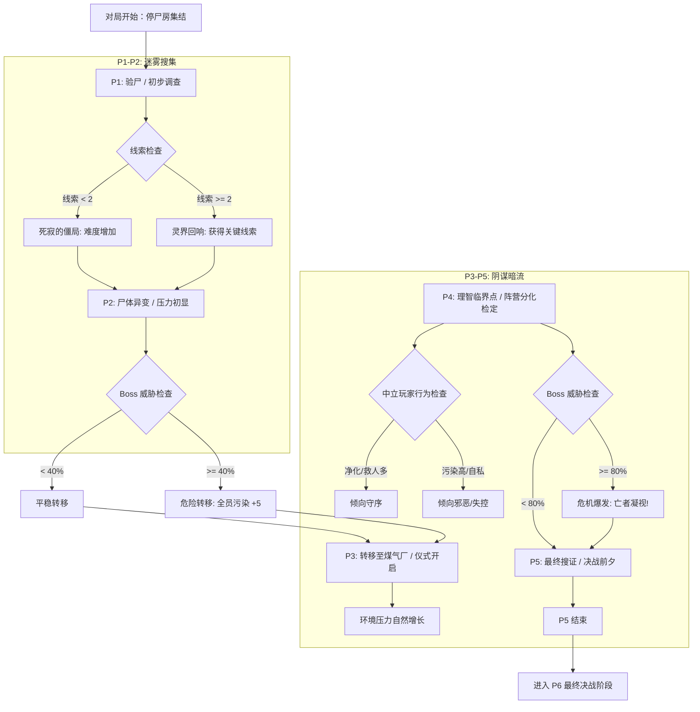

# 剧情架构与流程图：P1-P5 搜证与生存

> **核心机制**：混合推进（轮次定场景 + 阈值触事件）
> **公共敌人**：失控的通灵者 (Sequence 7)

## 1. 阶段流程图 (Flowchart)

## 2. 关键分支说明

### 分支 A：中立玩家的演化 (P4 阶段)
*   **触发时机**：P4 轮次结束时。
*   **判定逻辑**：
    *   **守序倾向**：使用“净化/护盾”卡牌次数 $\ge$ 3 次，且当前污染 $< 40\%$。
        *   *结果*：`faction` 变更为 `investigator`，获得“人性”Buff（灵性上限 +1）。
    *   **邪恶倾向**：当前污染 $\ge 60\%$，或使用了“仪式”类卡牌。
        *   *结果*：`faction` 变更为 `polluted`，获得“神性”Buff（仪式推进效率翻倍）。
    *   **边缘状态**：若不满足以上条件，保持 `unknown`，但在 P5 阶段受到的 Boss 伤害翻倍（由于意志薄弱）。

### 分支 B：Boss 危机爆发 (P3-P5)
*   **触发条件**：`Boss.threatLevel` 在 P3 结束时 $\ge 80\%$。
*   **效果**：
    1.  **亡者凝视**：所有玩家污染度 $+10$。
    2.  **线索失效**：本轮打出的“调查”牌获得的线索减半（因为 Boss 干扰了灵界）。
    3.  **剧情提示**：“失控的通灵者发现了你们，它发出了刺耳的尖啸，停尸房的灯光瞬间熄灭……”

## 3. 阵营与剧情对应
*   **调查者 (守序)**：剧情上表现为试图封印 Boss，保护贝克兰德。
*   **渗透者 (邪恶)**：剧情上表现为试图引导 Boss 的力量，完成仪式。
*   **失控边缘者 (中立->邪恶)**：剧情上表现为被 Boss 吸引，最终成为 Boss 降临的容器。
