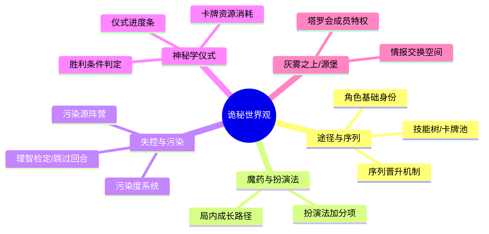
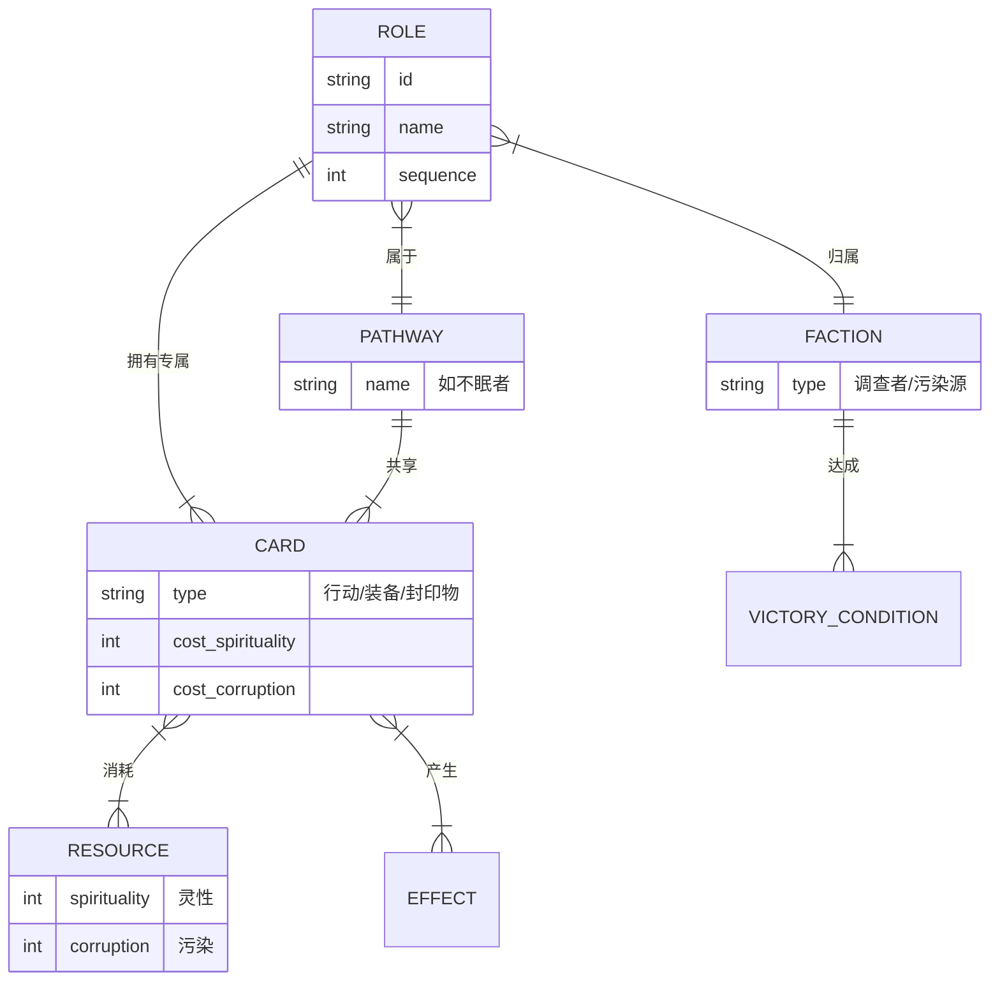
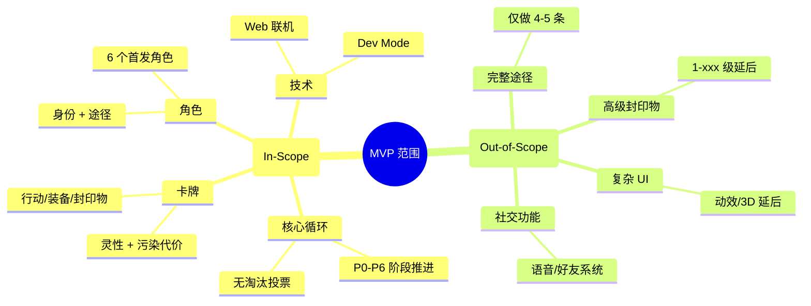
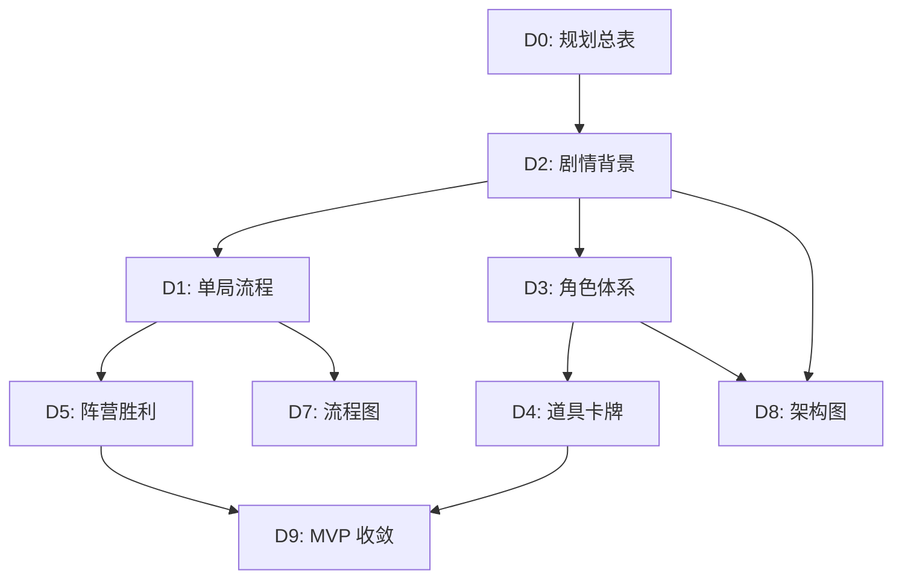

# 架构图与关系图 — 「值夜者档案：贝克兰德大雾霾」

> 本文档汇总游戏的概念结构图与关系图 (Mermaid)，用于映射世界观到玩法机制，并理清角色、卡牌、系统的层级关系。

---

## 1. 世界观与玩法映射图 (Worldview Mapping)

**用途**：将《诡秘之主》的核心设定映射为游戏内的具体机制。
**适用文档**：`剧情背景设定文档`、`玩法规则书`



---

## 2. 核心概念关系图 (Concept Relationship)

**用途**：展示角色、阵营、卡牌、资源之间的逻辑关系。
**适用文档**：`角色体系设计文档`、`道具与卡牌体系文档`



---

## 3. 游戏结构分层图 (Game Structure Layering)

**用途**：将复杂的系统拆解为 4 个层级，便于理解和开发。
**适用文档**：`单局流程设计文档`、`系统架构设计`

```mermaid
graph TD
    subgraph UI [表现层 (UI/UX)]
        UI1[游戏界面/立绘]
        UI2[卡牌展示/动画]
        UI3[聊天/讨论区]
        UI4[结算面板]
    end
    
    subgraph Logic [逻辑层 (Game Logic)]
        Logic1[状态机/阶段流转]
        Logic2[卡牌效果结算]
        Logic3[投票/指认系统]
        Logic4[资源管理/污染计算]
    end
    
    subgraph Data [数据层 (Data Model)]
        Data1[用户/房间信息]
        Data2[对局快照/Log]
        Data3[卡牌/角色配置]
    end
    
    subgraph Infra [基础设施层 (Infra)]
        Infra1[WebSocket 通信]
        Infra2[数据库存储]
        Infra3[房间匹配/管理]
    end
    
    UI --> Logic
    Logic --> Data
    Data --> Infra
```

---

## 4. MVP 内容范围图 (MVP Scope)

**用途**：明确 MVP 阶段包含与排除的内容，防止开发蔓延 (Feature Creep)。
**适用文档**：`MVP 边界收敛文档`



---

## 5. 文档依赖图 (Doc Dependency)

**用途**：展示各设计文档之间的依赖关系，指导后续更新顺序。
**适用文档**：`文档结构总表`、`项目管理`



---

*本文档创建日期：2026-05-14*
*状态：已完成，与 D1-D5 设计保持一致*
