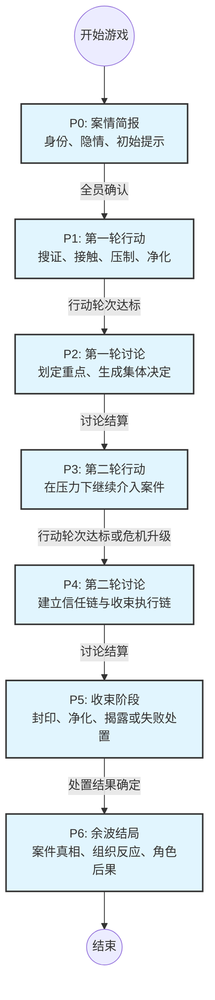
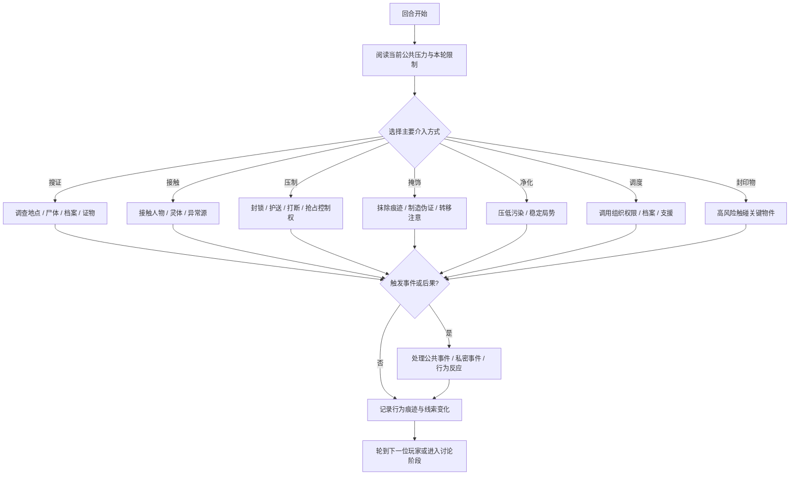
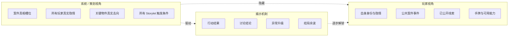
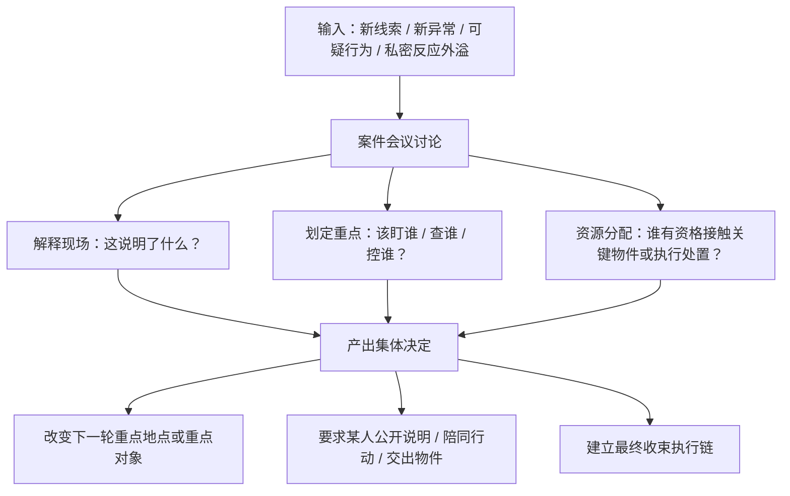
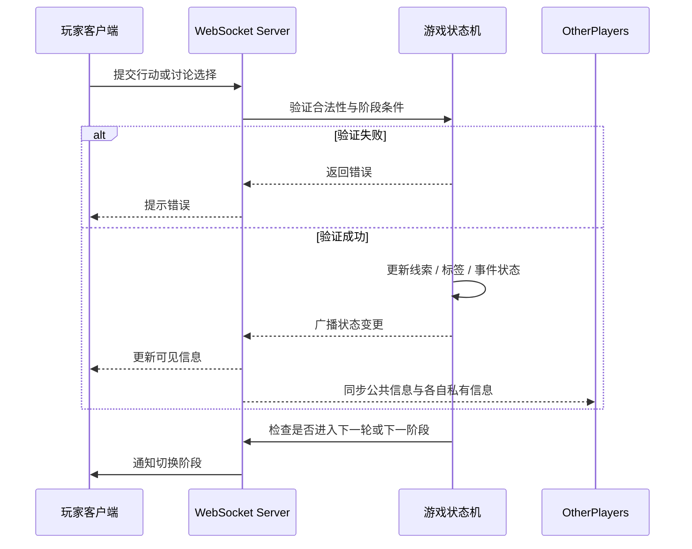

# 流程图集合 — 调查模式

> 本文档汇总调查模式当前使用的流程图（Mermaid），用于可视化单局主流程、回合逻辑、信息流转及系统交互。

---

## 1. 单局游戏主流程图

**用途**：展示从开局到结局的完整 7 个阶段及其流转条件。  
**适用文档**：`单局流程设计文档`、`规则手册`

---

# 2. 单轮行动流程图

**用途**：细化 P1 / P3 阶段中，单个玩家在自己回合内的操作循环。  
**适用文档**：`单局流程设计文档`、`调查模式行动卡分类文档`

---

## 3. 玩家视角信息流图

**用途**：展示“系统全知”与“玩家有限视角”之间的信息差异。  
**适用文档**：`调查模式信息架构文档`

---

## 4. 讨论阶段决策流程图

**用途**：说明讨论为什么存在，以及讨论如何改变下一阶段。  
**适用文档**：`单局流程设计文档`、`调查模式产品定义文档`

---

## 5. 房主 / 玩家 / 系统交互流程图

**用途**：描述实时房间下，各方状态的同步时序。  
**适用文档**：`网络同步策略`、`实现规划`

---

*本文档更新日期：2026-05-17*  
*状态：调查模式当前流程图主版本*
