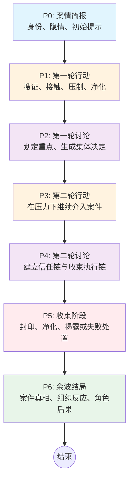

# 单局流程设计文档 — 调查模式

> 本文档定义调查模式一局游戏从开始到结束的完整流程。  
> 当前版本不包含独立“卡牌对决”终局，单局目标是完成一场带《诡秘之主》氛围的超凡案件处置。

---

## 1. 单局体验目标

| 维度 | 目标 |
|---|---|
| 核心体验 | 在贝克兰德调查异常案件，利用序列能力、组织资源和集体判断逼近真相并完成处置 |
| 世界观表达 | 让玩家从机制里感受到组织程序、序列代价、封印物风险、污染蔓延 |
| 节奏控制 | 45-75 分钟，7 个阶段，全程无淘汰 |
| 信息曲线 | 公开案情明确，私密真相逐步揭示，结局时完成案件线与人际线收口 |
| 社交互动 | 每轮讨论都有明确输入、明确目标、明确后果，是“案件会议”而不是自由发言 |

---

## 2. 单局结构总览

| 阶段 | 名称 | 玩家重点 | 系统重点 | 建议时长 |
|---|---|---|---|---|
| P0 | 案情简报 | 进入角色、理解处境 | 发放身份、隐情、初始提示 | 5 min |
| P1 | 第一轮行动 | 用卡牌与能力介入案件 | 产出首批公共/私密信息 | 10-15 min |
| P2 | 第一轮讨论 | 解释线索、争夺主导权 | 生成首轮集体决定 | 5-8 min |
| P3 | 第二轮行动 | 在压力下继续行动 | 释放更强的私密事件与风险 | 10-15 min |
| P4 | 第二轮讨论 | 决定信任链与最终执行人 | 生成强制收束前的集体措施 | 6-10 min |
| P5 | 收束阶段 | 完成封印、揭露、净化或失败处置 | 结算前面所有积累状态 | 8-12 min |
| P6 | 余波结局 | 复盘案件与角色命运 | 输出真相、组织反应和结局分支 | 4-6 min |

---

## 3. 各阶段详细设计

### P0：案情简报

#### 玩家视角

- 我是谁
- 我为什么会被派来
- 这起案子哪里不对劲
- 我当前最怕暴露什么

#### 公共信息

- 案件标题与概要
- 现场异常现象
- 教会、警署或值夜者的压力来源
- 今夜不能拖延的原因

#### 私密信息

- 角色身份卡
- 序列能力卡
- 本局隐情
- 初始私密提示
- 与案件的个人联系

#### 系统输出

- 初始化角色、隐情、起始手牌、起始标签
- 为每名玩家种下第一条 Storylet 触发线索

#### 阶段目标

让玩家进入“案件中的人”，而不是先看一堆系统说明。

### P1：第一轮行动

#### 玩家可选动作

- `搜证`：在地点、遗物、尸体、记录中寻找线索
- `接触`：私下接触人、物或超凡痕迹
- `压制`：用强制手段封锁现场、驱散异常、带走目标
- `掩饰`：抹除痕迹、改写叙述、替换证物、隐藏异常
- `净化`：安抚、祷告、短时稳定污染
- `调度`：调用组织权限、人手、记录或额外支持
- `触碰封印物`：高风险换高价值信息或能力

#### 阶段任务

- 产出第一批公共线索
- 让玩家留下可被讨论的行为痕迹
- 打开第一批私密事件

#### 设计要点

- 本轮不追求“打出爆发”，而追求“制造可解释的事实与可怀疑的行为”
- 卡牌在这里是调查手段，而不是战斗连招

### P2：第一轮讨论

#### 讨论输入

- 公共线索
- 新增异常
- 显眼行为痕迹
- 某些私密事件溢出的公开反应

#### 讨论必须回答的问题

1. 现场异常最可能指向哪条线？
2. 目前最需要重点盯住谁或什么？
3. 下一轮集体资源优先投向哪里？

#### 讨论输出

- `重点监视对象`
- `优先调查方向`
- 一项轻至中强度的集体措施：
  - 授权搜查
  - 要求公开说明
  - 限制单独行动
  - 指定陪同调查

#### 为什么这一轮讨论成立

因为线索是碎片化的，且不同角色看到的东西并不相同。玩家必须通过发言与试探，把碎片拼成“目前最值得推进的叙事”。

### P3：第二轮行动

#### 与第一轮的不同

- 玩家带着被贴上的信任与怀疑标签进入行动
- 某些地点、人物、物件已经被重点处理或限制
- 污染、组织冲突与私密事件进入更强状态

#### 阶段重点

- 让调查者决定是否继续追真相
- 让污染立场决定继续潜伏还是提前引爆
- 让摇摆角色决定保命、投机还是表态

#### 系统输出

- 更强的公共压力
- 更高风险的私密诱导
- 第二批关键线索
- 行为后果更加明显

### P4：第二轮讨论

#### 讨论输入

- 第二轮新线索
- 被验证或被推翻的第一轮判断
- 更强的异常表现
- 某些角色被逼出的公开承认或失态

#### 讨论必须回答的问题

1. 谁最不可信，是否需要限制或隔离？
2. 谁最适合接触最终关键物件或执行处置？
3. 如果判断错了，最坏后果会落到哪里？

#### 讨论输出

- `最终怀疑对象`
- `收束执行者` 或 `执行小组`
- 一项中强度集体措施：
  - 交出关键物件
  - 强制协同行动
  - 禁止单独接触核心地点
  - 公开立场承诺

#### 设计要点

这一轮的核心不是“把坏人票出去”，而是建立最终处置前的信任链与控制链。

### P5：收束阶段

#### 阶段定位

不是战斗，而是案件处置。

#### 可能的处置路径

- `封印`：完成仪式或封闭异常源头
- `净化`：暂时压制污染并保住现场秩序
- `揭露`：公开关键真相，逼迫立场暴露
- `失控`：因判断错误或代价过高引发局面崩坏
- `错误处置`：表面结束，实则留下更深后果

#### 收束阶段结算的内容

- 线索积累
- 信任关系
- 污染状态
- 物件控制权
- 角色是否履行或违背承诺
- 私密任务与隐情是否被引爆

#### 爽点来源

- 前面说的话要兑现
- 前面藏的东西要暴露
- 前面建立的关系现在要承担代价

### P6：余波结局

#### 结局必须回答

- 案件真相究竟是什么
- 谁推动了正确或错误的处置
- 哪些组织会如何记录这一夜
- 哪些角色保住了理智，哪些角色留下了伤痕
- 污染是否真正结束，还是只是被暂时按下

#### 设计要点

结局不能只显示阵营输赢，而必须让玩家感觉“这一夜发生过一个完整案件”。

---

## 4. 讨论为何是系统核心

| 维度 | 说明 |
|---|---|
| 输入 | 新线索、新异常、新可疑行为、新私密事件的外溢效果 |
| 目标 | 第一轮讨论负责划定重点，第二轮讨论负责建立最终处置的信任链 |
| 后果 | 决定谁被重点处理、谁能执行关键行动、哪些地点和物件进入控制状态 |
| 价值 | 让发言真正改变局势，而不是停留在气氛层 |

---

## 5. 一轮与一局的关系

| 概念 | 定义 | 时长 |
|---|---|---|
| 一局 | P0→P6 的完整案件流程 | 45-75 min |
| 一阶段 | 一个大段体验，如第一轮行动、第二轮讨论 | 5-15 min |
| 一回合 | 一名玩家在行动阶段完成一次主要介入 | 1-3 min |

---

## 6. 调查模式与未来对决模式的边界

| 维度 | 调查模式当前定义 | 不做什么 |
|---|---|---|
| 卡牌职责 | 调查、掩饰、净化、压制、调度、封印物介入 | 不做独立战斗连招系统 |
| 社交互动 | 结构化讨论与案件会议 | 不做纯自由聊天 |
| 高潮表达 | 通过收束阶段完成案件处置 | 不做单独切入另一套卡牌对战玩法 |
| 世界观表达 | 通过组织程序、序列代价、污染风险体现 | 不靠大段说明文硬灌设定 |

---

## 7. 流程图

---

*本文档更新日期：2026-05-17*  
*状态：调查模式当前主定义文档*
